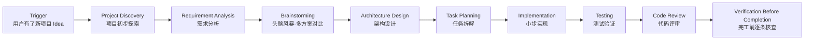

# Start Project · 启动一个新的项目

> 🎯 **一句话**：把脑袋里的想法，一步步变成能跑的软件。

⚠️ **Not Yet Verified — 流程已定义，尚未在真实项目中完整跑通。**

---

## Trigger · 什么情况下启动本流程

当你出现下面任意一种情况时，就启动本流程：

- **有一个新的 Idea**，想把它做成真正的软件 / 网站 / App / 工具
- 老板 / 朋友 / 自己给了一个全新的项目目标，还没写过一行代码
- 想把一个"手动重复劳动"变成自动化程序，第一次做这件事

> 💡 小贴士：如果项目已经存在、只是想加新功能，走 [feature-development](../feature-development/README.md) 流程。

---

## Skill Chain · 技能链

---

## Steps · 步骤详解

### Step 1 — Project Discovery · 项目初步探索

目标：先搞清楚"为什么做"和"谁来用"，产出一份 **Project Brief（项目简况）**。

关键动作：
- 回答 5 个问题：给谁用？解决什么痛？现在怎么解决？成功了长啥样？最晚什么时候要？
- 把答案写成 1 页可阅读的简况，不要写代码。

关联技能：
- [../../skills/core/project-discovery/README.md](../../skills/core/project-discovery/README.md) · Project Discovery 技能文档
- [../../skills/core/project-discovery/SKILL.md](../../skills/core/project-discovery/SKILL.md) · SKILL 规范

关联 Prompt：
- [../../prompts/start-here/start-project.md](../../prompts/start-here/start-project.md) · 启动项目的引导提问 Prompt

---

### Step 2 — Requirement Analysis · 需求分析

目标：把简况拆成 **FR（功能需求）+ NFR（非功能需求，比如速度/安全/兼容）+ 验收条件**。

关键动作：
- FR：列出所有"系统能做什么"（如"用户可以注册登录"）
- NFR：列出"系统表现得怎么样"（如"首屏 < 3 秒""兼容移动端"）
- 验收条件：每条需求写清楚"怎么才算做对了"（Acceptance Criteria）

关联技能：
- [../../skills/core/requirement-analysis/README.md](../../skills/core/requirement-analysis/README.md)
- [../../skills/core/requirement-analysis/SKILL.md](../../skills/core/requirement-analysis/SKILL.md)

关联 Prompt：
- [../../prompts/architecture/analyze-requirement.md](../../prompts/architecture/analyze-requirement.md)

---

### Step 3 — Brainstorming · 头脑风暴（≥3 方案对比）

目标：不拍脑袋选方案，至少想 3 条路，对比优缺点再挑一个。

关键动作：
- 方案 A / B / C 分别写清楚：做什么、技术栈、优缺点、实施成本
- 做一张对比表（评分：成本 / 速度 / 可维护 / 扩展性）
- 选一条"当前最合适"的路线，记下"为什么没选其他方案"

关联技能：
- [../../skills/core/brainstorming/README.md](../../skills/core/brainstorming/README.md)
- [../../skills/core/brainstorming/SKILL.md](../../skills/core/brainstorming/SKILL.md)

---

### Step 4 — Architecture Design · 架构设计

目标：画出"系统由哪几块组成、互相怎么连、用什么技术"。

关键动作：
- 画模块图（Mermaid flowchart），列出核心模块 + 数据流向
- 定技术选型：前端框架 / 后端语言 / 数据库 / 部署方式
- 输出 Architecture Document（架构文档），含模块说明 + 选型理由

关联技能：
- [../../skills/core/architecture-design/README.md](../../skills/core/architecture-design/README.md)
- [../../skills/core/architecture-design/SKILL.md](../../skills/core/architecture-design/SKILL.md)

关联 Prompt：
- [../../prompts/architecture/design-architecture.md](../../prompts/architecture/design-architecture.md)

---

### Step 5 — Task Planning · 任务拆解

目标：把架构拆成"半天以内能做完"的小任务，并列出依赖。

关键动作：
- 每个任务：标题 + 预计工时（≤ 4 小时）+ 输入 + 产出
- 画依赖图：哪些任务必须等前面的做完才能开始
- 产出 Development Plan（开发计划），可以作为开发时的 Checklist

关联技能：
- [../../skills/core/task-planning/README.md](../../skills/core/task-planning/README.md)
- [../../skills/core/task-planning/SKILL.md](../../skills/core/task-planning/SKILL.md)

关联 Prompt：
- [../../prompts/architecture/write-development-plan.md](../../prompts/architecture/write-development-plan.md)

---

### Step 6 — Implementation · 小步实现

目标：按任务清单一件一件做，每做完一个就跑一下当前能用的最小版本。

关键动作：
- 一个任务一个任务完成，不要同时开多个任务
- 每个任务完成后，立刻做"最小可验证"（比如跑通 / 看到效果）
- 代码写注释，不要堆一大坨再回头补

关联技能：
- [../../skills/core/implementation/README.md](../../skills/core/implementation/README.md)
- [../../skills/core/implementation/SKILL.md](../../skills/core/implementation/SKILL.md)

关联 Prompt：
- [../../prompts/coding/implement-feature.md](../../prompts/coding/implement-feature.md)

---

### Step 7 — Testing · 测试验证

目标：写出"最小可验证测试"，证明你写的东西确实对。

关键动作：
- 最少写：单测（函数级）+ 集成测（模块级）+ 手测（关键路径）
- 对需求清单，一条条勾"测试过了 / 没测过"
- 测完要保留测试命令和结果截图 / 日志

关联技能：
- [../../skills/core/testing/README.md](../../skills/core/testing/README.md)
- [../../skills/core/testing/SKILL.md](../../skills/core/testing/SKILL.md)

关联 Prompt：
- [../../prompts/testing/write-tests.md](../../prompts/testing/write-tests.md)
- [../../prompts/testing/verify-feature.md](../../prompts/testing/verify-feature.md)

---

### Step 8 — Code Review · 代码评审

目标：用结构化清单过一遍代码，把"明显坑"在自己电脑上先堵了。

关键动作：
- 按 Code Review Checklist 一条一条勾：命名 / 注释 / 异常处理 / 安全 / 性能
- AI 辅助 Review + 自己过一遍，两者都要
- 记录评审结论：OK / 需要改（列出修改点）

关联技能：
- [../../skills/core/code-review/README.md](../../skills/core/code-review/README.md)
- [../../skills/core/code-review/SKILL.md](../../skills/core/code-review/SKILL.md)

关联 Prompt：
- [../../prompts/review/code-review.md](../../prompts/review/code-review.md)

---

### Step 9 — Verification Before Completion · 完工前核查

目标：把之前所有交付物逐条 ✅，别漏东西就交差。

关键动作：
- 核对交付物清单：Brief / 需求 / 架构 / 计划 / 代码 / 测试 / 评审
- 跑一次端到端演示（End-to-End Demo），录屏留档
- 填写"已验证 / 未验证 / 风险项"三栏

关联技能：
- [../../skills/core/verification-before-completion/README.md](../../skills/core/verification-before-completion/README.md)
- [../../skills/core/verification-before-completion/SKILL.md](../../skills/core/verification-before-completion/SKILL.md)

---

## Validation · 流程完成判定标准

满足下面**全部 6 条**才算本流程真的做完：

1. ✅ 有 Project Brief、需求文档（FR+NFR+验收条件）、架构文档、开发计划 4 份文档
2. ✅ 代码能在本地 `run` 起来，主流程跑通
3. ✅ 有 ≥ 1 组测试（单测/集成测都行），且全部通过
4. ✅ 完成过 ≥ 1 次结构化 Code Review，且修改点已落地
5. ✅ 跑过一次完工前核查，核查项 100% 打勾
6. ✅ 能对着别人 Demo 一遍，别人能跟着 README 跑起来

---

## When to Pause · 何时暂停 / 人工确认

| 检查点 | 原因 | 谁来拍板 |
| --- | --- | --- |
| 需求拆解完成后（Step 2 结束） | 需求范围直接影响架构和工量，AI 拆的需求可能有遗漏或过度 | 人确认 MVP 范围 |
| 技术选型时（Step 3 架构） | 技术栈一旦定了，后面全要遵循，AI 选的栈可能跟项目已有约定冲突 | 人确认技术栈 |
| 架构方案出炉后（Step 3 结束） | 架构决定模块边界，改起来代价大，AI 的模块划分可能不合理 | 人确认模块图 |

> 💡 如果只是"做个玩具试一下"，可以跳过部分确认。但只要涉及多人协作或长期维护，上面 3 个点必须人工拍板。

## Common Deviations · 常见偏离

| 偏离 | 长什么样 | 后果 | 怎么纠偏 |
|---|---|---|---|
| ⚠️ **跳过需求直接写代码** | 一上来就 `npm create xxx`，需求文档空着 | 做了一半发现方向错了，全删重来 | 先回 Step 1~2，花 30 分钟补完 Brief 和需求 |
| ⚠️ **只有 1 个方案就开干** | 直接说"我用 React + Node"，没对比 | 中途才发现选型不合适，迁移痛苦 | 回 Step 3，至少补 2 个替代方案的对比表 |
| ⚠️ **任务粒度太大** | 一个任务叫"做完登录系统"，预计 3 天 | 中间卡壳也不知道哪卡的，进度不可视 | 回 Step 5，拆到每个任务 ≤ 4 小时 |
| ⚠️ **不做评审 / 不做验证** | 写完就推，没有 Review 和核查 | 上线后才发现低级错误 / 漏需求 | 强制补 Step 8 和 Step 9，用 Checklist 逐条过 |
| ⚠️ **一次写太多代码** | 一天写完整个模块，中间没跑过 | Bug 积一堆，排到怀疑人生 | 回到 Step 6，每个任务完成就跑一下"最小可验证" |

---

## Related Workflows · 关联流程

- 🔗 [**feature-development**](../feature-development/README.md) — 项目起来后加新功能，走它。
- 🔗 [**release**](../release/README.md) — 做完想发布/上线，走它。
- 🔗 [**debugging**](../debugging/README.md) — 跑起来有 bug，走它。
- 🔗 [**refactoring**](../refactoring/README.md) — 代码写烂了想重写结构，走它。
