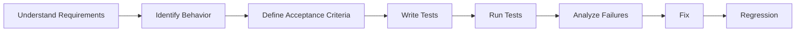

# Testing · 测试流程

> 🎯 **一句话**：不是"让 AI 自动生成测试代码"，而是系统性地证明代码能工作。

⚠️ **Not Yet Verified — 流程已定义，尚未在真实项目中完整跑通。**

---

## Trigger · 什么情况下启动本流程

- 功能开发完成，需要配测试
- Bug 修复后，需要回归测试
- 重构前后，需要验证行为没变
- 需要提升测试覆盖率

> 💡 测试不是可选的——没有测试的代码改了不知道有没有破坏。

---

## Workflow · 流程

### Step 1 — Understand Requirements · 理解需求

目标：搞清楚"测什么"——不是测代码，是测行为。

关键动作：
- 读需求文档，列出所有功能点
- 区分：正常路径 / 错误路径 / 边界情况

### Step 2 — Identify Behavior · 识别行为

目标：每个功能点应该有什么行为？

关键动作：
- 正常输入 → 期望输出
- 异常输入 → 期望错误
- 边界值 → 期望行为

### Step 3 — Define Acceptance Criteria · 定义验收标准

目标：每条测试的"通过条件"是客观的。

关键动作：
- 每条验收标准可以回答"过了没过"
- 不是"看起来对了"——是"输出等于期望值"

### Step 4 — Write Tests · 写测试

目标：把验收标准变成可自动执行的测试代码。

关联技能：[testing](../../skills/core/testing/SKILL.md)
关联 Prompt：[write-tests](../../prompts/testing/write-tests.md)

### Step 5 — Run Tests · 跑测试

目标：执行测试，记录结果。

关键动作：
- 全部跑一遍，记录通过/失败
- 失败的记录原因

### Step 6 — Analyze Failures · 分析失败

目标：测试为什么失败？

- 是代码 Bug？→ 走 [bug-fix](../bug-fix/README.md) 修复
- 是测试写错了？→ 修测试
- 是验收标准不合理？→ 调整标准

### Step 7 — Regression · 回归

目标：修复后跑全部测试确认没有新问题。

---

## Validation · 流程完成判定标准

1. ✅ 有测试文件，覆盖正常路径 + 错误路径
2. ✅ 测试能一键运行（npm test / pytest）
3. ✅ 全部测试通过
4. ✅ 有覆盖率报告（如有）

---

## When to Pause · 何时暂停 / 人工确认

| 检查点 | 原因 | 谁来拍板 |
| --- | --- | --- |
| 测试策略选择 | 单测/集成/E2E 的比例影响成本 | 人确认策略 |
| 测试失败后 | 是代码Bug还是测试写错？ | 人判断方向 |

---

## AI Responsibilities

> AI 可以自主做的事情。

- 生成测试代码
- 运行测试
- 分析失败原因
- 生成覆盖率报告

## Human Responsibilities

> 必须由人确认的事情。

- 确认测试策略
- 确认验收标准合理性
- 判断失败是代码问题还是测试问题

## Stop Conditions

> 什么时候必须停下来。

- 验收标准不明确时停
- 测试持续失败且根因不清时停

## Output

> 本流程的产出物。

- 测试文件
- 测试结果（通过/失败数）
- 覆盖率报告（如有）

## Common Failure Modes

| 偏离 | 后果 | 纠偏 |
| --- | --- | --- |
| 只测正常路径 | 错误场景无保护 | 补错误路径 + 边界测试 |
| 测试之间有依赖 | A 失败导致 B/C 全挂 | 每个测试独立 |
| 不跑回归 | 修好一个引入三个 | 修复后必须跑全部 |

## Related Skills

- [testing](../../skills/core/testing/SKILL.md)
- [verification-before-completion](../../skills/core/verification-before-completion/SKILL.md)
- [code-review](../../skills/core/code-review/SKILL.md)

## Related Prompts

- [write-tests](../../prompts/testing/write-tests.md)
- [verify-feature](../../prompts/testing/verify-feature.md)

## Related Cases

- [AI Chat](../../cases/golden/001-ai-chat/README.md)

## Related Workflows

- 🔗 [feature-development](../feature-development/README.md) — 功能开发完走测试
- 🔗 [bug-fix](../bug-fix/README.md) — Bug 修复后走回归测试
- 🔗 [refactoring](../refactoring/README.md) — 重构前后走测试
